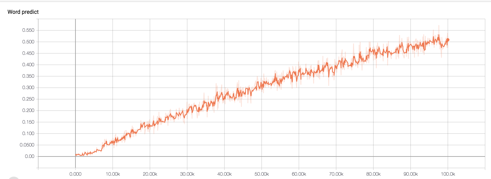
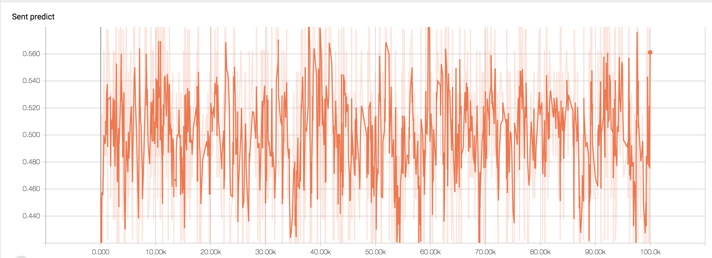
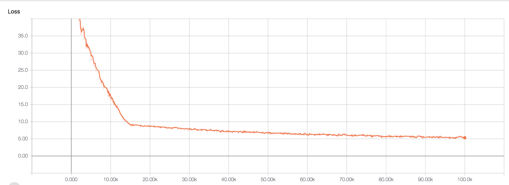
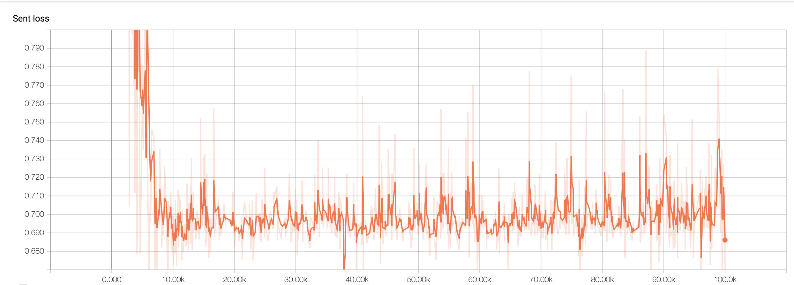

## BERT: Bidirectional Encoder Representations from Transformers
Module implemention from [BERT: Pre-training of Deep Bidirectional Transformers for Language Understanding](https://arxiv.org/abs/1810.04805)

## Dataset
Perform experiments on the English data from [Corpus](https://drive.google.com/uc?export=download&confirm=MbFE&id=0B2Mzhc7popBga2RkcWZNcjlRTGM)

## Tutorial
Get [Tutorial](https://ne7ermore.github.io/post/bert) if know Chinese

Downloaded Gutenberg.zip to ${PROJECT}/data or CNN data

## train

Step.1 - prepare corpus

```python
python3 fuel.py or fuel_cnn.py
python3 corpus.py
```

Step.2 - Train data
```python
python3 train
```

<p align="center">

</p>

<p align="center">

</p>

<p align="center">

</p>

<p align="center">

</p>

<p align="center">

</p>
