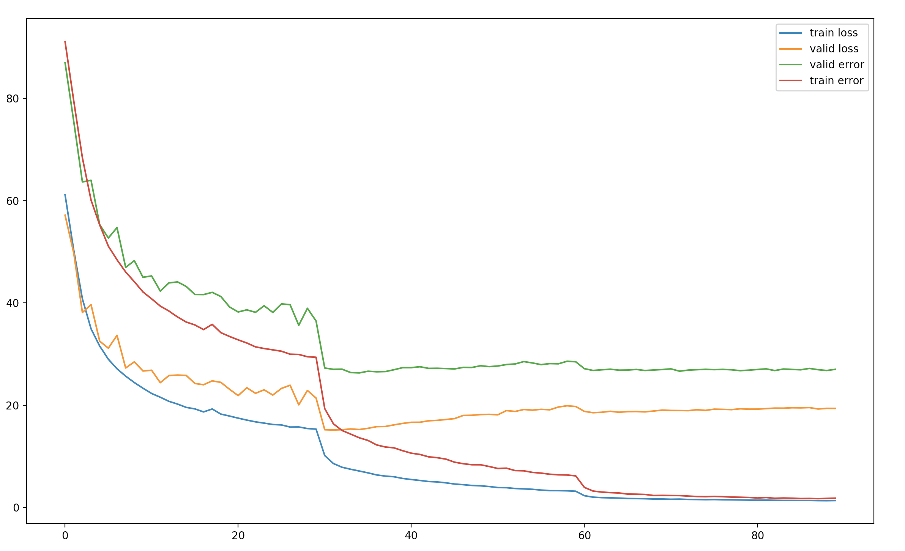

## A PyTorch Implementation of DenseNet
Module implemention from DenseNet-BC architecture as described in the paper [Densely Connected Convolutional Networks](https://arxiv.org/abs/1608.06993) by G. Huang, Z. Liu, K. Weinberger, and L. van der Maaten.

## Datasets
Training and evaluation with CIFAR-100

## Result

## Requirement
* python 3.5
* pytorch 0.2.0
* numpy 1.13.1
