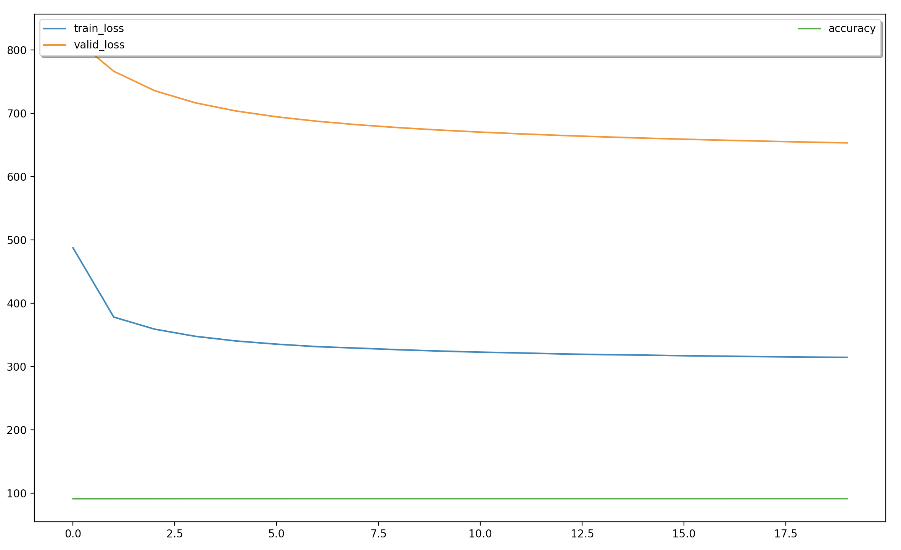

## Introduction
Module implemention from "[CEnd-to-end Sequence Labeling via Bi-directional LSTM-CNNs-CRF](https://arxiv.org/abs/1603.01354)". <br>
Perform experiments on the English data from [CoNLL 2003](https://www.clips.uantwerpen.be/conll2003/ner/)

## Requirement
* python 3.5
* pytorch 0.4.0
* numpy 1.13.1
* tqdm

## Usage
```
python3 train.py -h
```

You will get:

```
usage: train.py [-h] [--epochs EPOCHS] [--batch-size BATCH_SIZE] [--seed SEED]
                [--cuda-able] [--lr LR] [--use-crf] [--save SAVE]
                [--save-epoch] [--data DATA] [--char-ebd-dim CHAR_EBD_DIM]
                [--kernel-num KERNEL_NUM] [--filter-size FILTER_SIZE]
                [--word-ebd-dim WORD_EBD_DIM] [--dropout DROPOUT]
                [--lstm-hsz LSTM_HSZ] [--lstm-layers LSTM_LAYERS] [--l2 L2]
                [--clip CLIP]

LSTM CNN CRF

optional arguments:
  -h, --help            show this help message and exit
  --epochs EPOCHS       number of epochs for train
  --batch-size BATCH_SIZE
                        batch size for training
  --seed SEED           random seed
  --cuda-able           enables cuda
  --lr LR               learning rate
  --use-crf             use crf
  --save SAVE           path to save the final model
  --save-epoch          save every epoch
  --data DATA           location of the data corpus
  --char-ebd-dim CHAR_EBD_DIM
                        number of char embedding dimension
  --kernel-num KERNEL_NUM
                        number of kernel
  --filter-size FILTER_SIZE
                        filter size
  --word-ebd-dim WORD_EBD_DIM
                        number of word embedding dimension
  --dropout DROPOUT     the probability for dropout
  --lstm-hsz LSTM_HSZ   BiLSTM hidden size
  --lstm-layers LSTM_LAYERS
                        biLSTM layer numbers
  --l2 L2               l2 regularization
  --clip CLIP           gradient clipping
```

## Train
```
python3 train.py
```

## Result

> Acc: 91.5%
<p align="center"></p>
