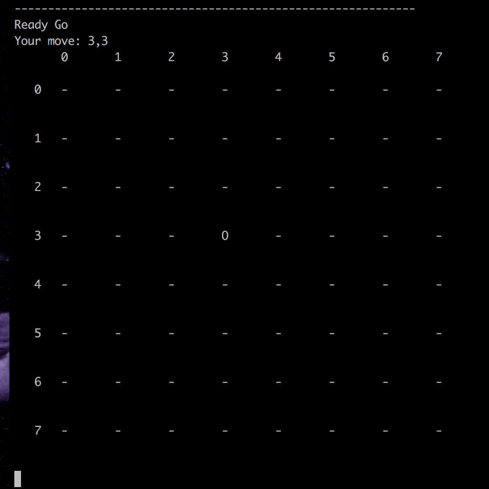
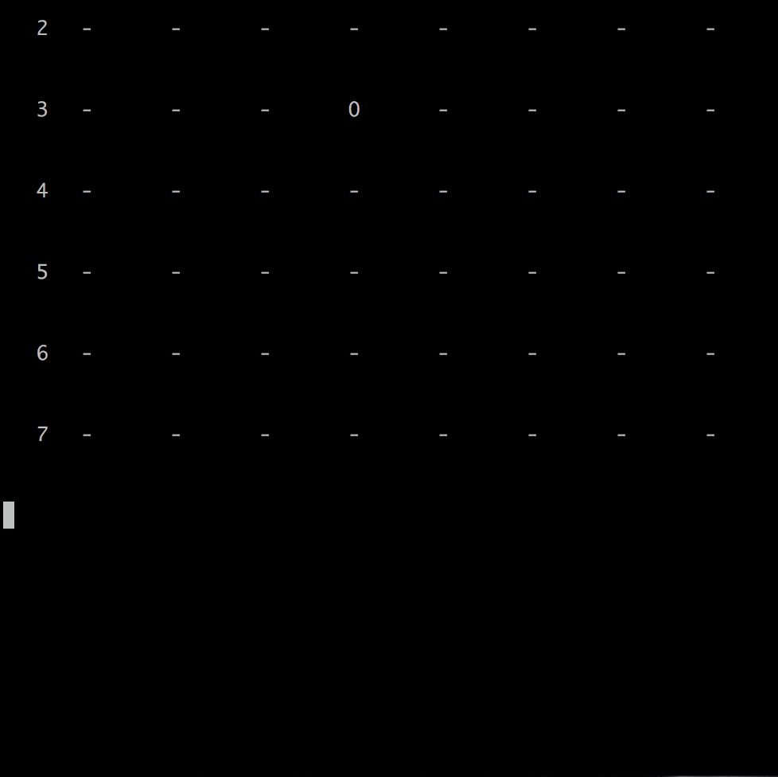

## AlphaGo Zero
Module implemention from [Mastering the Game of Go without Human Knowledge](https://www.nature.com/articles/nature24270.epdf?author_access_token=VJXbVjaSHxFoctQQ4p2k4tRgN0jAjWel9jnR3ZoTv0PVW4gB86EEpGqTRDtpIz-2rmo8-KG06gqVobU5NSCFeHILHcVFUeMsbvwS-lxjqQGg98faovwjxeTUgZAUMnRQ)

### Tutorial
[Click me](https://ne7ermore.github.io/post/alpha-zero/) to get tutorial

### Games
Gomoku

## Requirement
* python 3.6.2
* pytorch 0.4.0
* numpy 1.14.0

## Use

#### How to play
```
python3 play.py
```

#### How to train
```
python3 train.py
```

## Result

> self play 1300 games

<p align="center"></p>

> self play 2400 games

<p align="center"></p>
