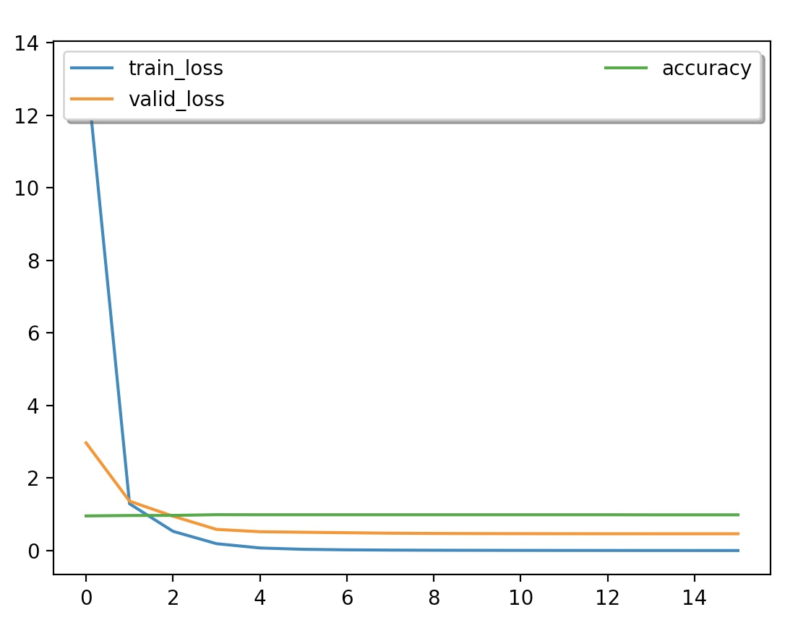

## Introduction
Module implemention from "[Convolutional Neural Networks for Sentence Classification](https://arxiv.org/abs/1408.5882)". <br>
Perform experiments on the English data from [TREC](http://cogcomp.org/Data/QA/QC/)

## Requirement
* python 3.5
* pytorch 0.2.0
* numpy 1.13.1
* tqdm

## Usage
```
python3 main.py -h
```

You will get:

```
usage: main.py [-h] [--lr LR] [--epochs EPOCHS] [--batch-size BATCH_SIZE]
               [--save SAVE] [--data DATA] [--dropout DROPOUT]
               [--embed-dim EMBED_DIM] [--kernel-num KERNEL_NUM]
               [--filter-sizes FILTER_SIZES] [--seed SEED] [--cuda-able]

CNN text classification

optional arguments:
  -h, --help            show this help message and exit
  --lr LR               initial learning rate [default: 0.001]
  --epochs EPOCHS       number of epochs for train [default: 32]
  --batch-size BATCH_SIZE
                        batch size for training [default: 64]
  --save SAVE           path to save the final model
  --data DATA           location of the data corpus
  --dropout DROPOUT     the probability for dropout (0 = no dropout) [default:
                        0.5]
  --embed-dim EMBED_DIM
                        number of embedding dimension [default: 128]
  --kernel-num KERNEL_NUM
                        number of each kind of kernel
  --filter-sizes FILTER_SIZES
                        filter sizes
  --seed SEED           random seed
  --cuda-able           enables cuda
```

## Train
```
python3 main.py
```

## Result

> Acc: 91.6%
<p align="center"></p>
