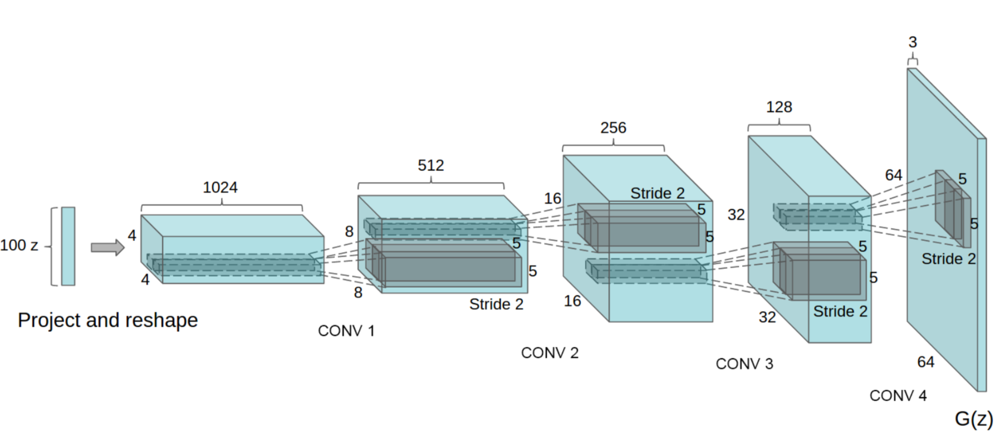
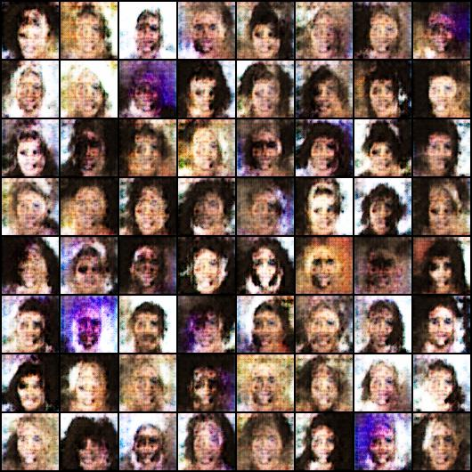
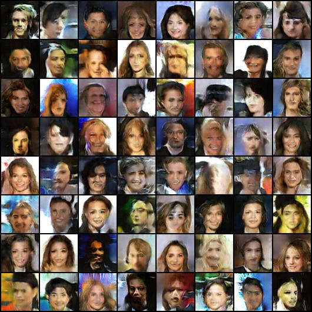
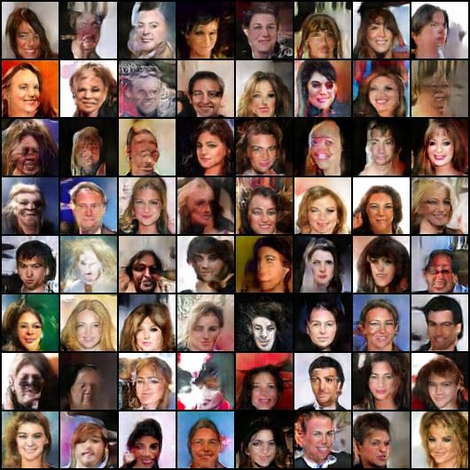
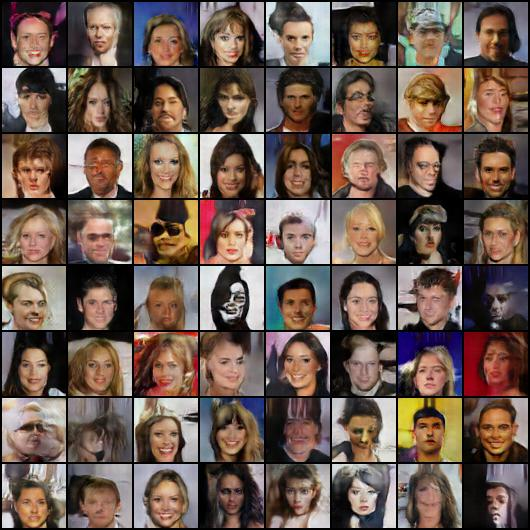
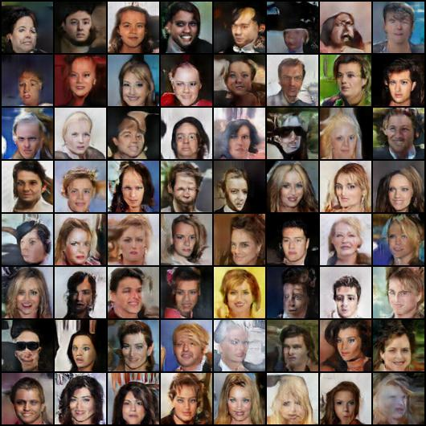
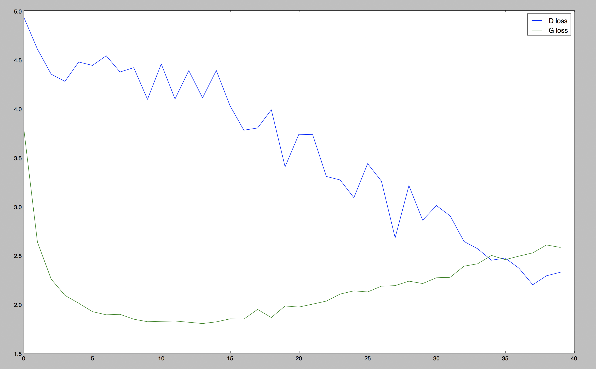

## Introduction
Deep Convolutional Generative Adversarial Networks.
Module implemention from "[Unsupervised Representation Learning with Deep Convolutional Generative Adversarial Networks](https://arxiv.org/abs/1511.06434)". <br>

<p align="center"></p>

## Requirement
* python 3.5
* pytorch 0.2.0
* numpy 1.13.1
* PIL

## Train
```
python train.py
```

## Result

### epoch 2
<p align="center"></p>

### epoch 10
<p align="center"></p>

### epoch 20
<p align="center"></p>

### epoch 30
<p align="center"></p>

### epoch 40
<p align="center"></p>

### loss
<p align="center"></p>