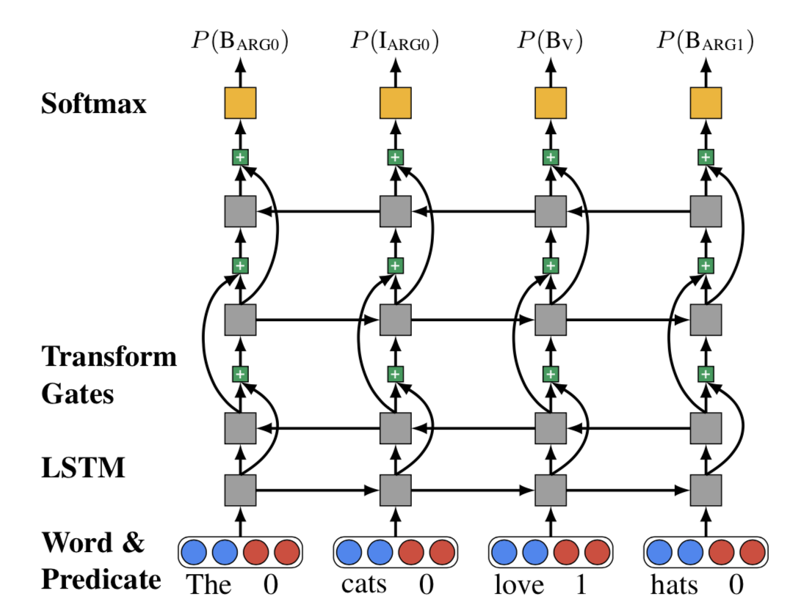
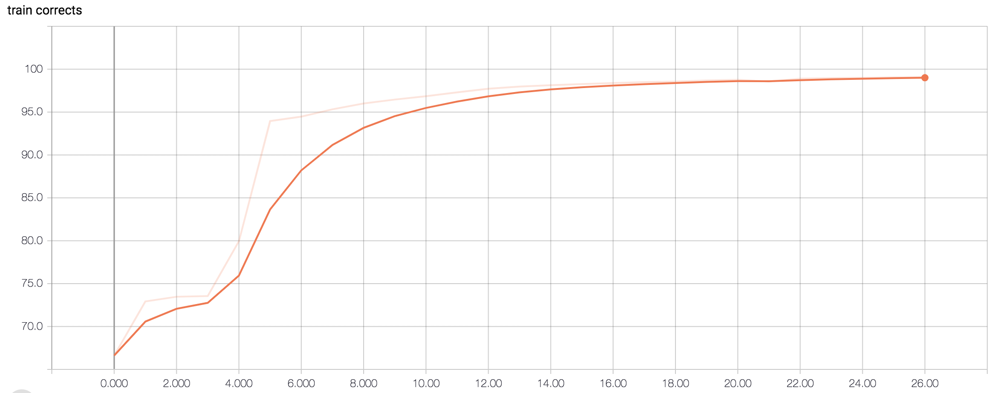
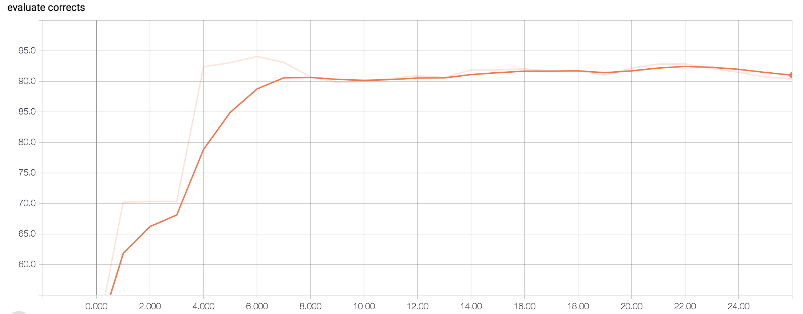
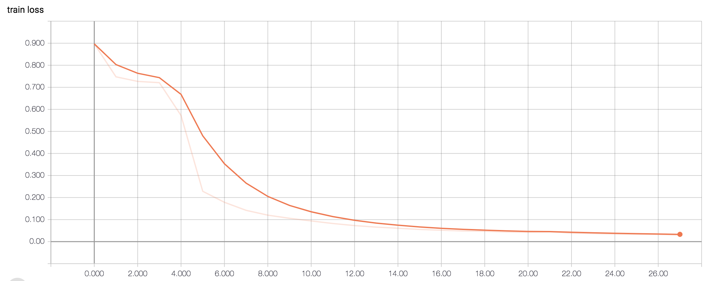
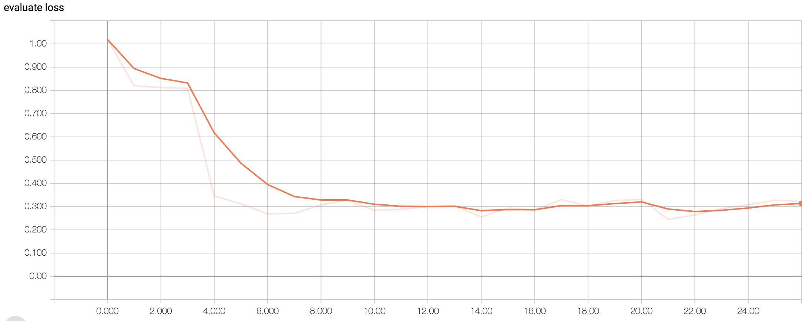

## Introduction
Module implemention from "[Deep Semantic Role Labeling: What Works and What’s Next](https://pdfs.semanticscholar.org/874e/f2e5488fcce82c48ed5b00fa1e5390a918e3.pdf)". <br>

<p align="center">

</p>

## Tutorial
Get [Tutorial](https://ne7ermore.github.io/post/deep-srl/) if know Chinese

## Requirement
* python 3.6
* pytorch 0.4.1
* numpy 1.13.1

## Database
Perform experiments on the English data from [CoNLL 2003](https://www.clips.uantwerpen.be/conll2003/ner/)

Have downloaded in ${PROJECT}/data
```
data
├── testa
├── testb
└── train
```

## Train

Step.1 - Generate Corpus.pt
```
python3 corpus.py
```

Step.2 - Train data
```
python3 train.py
```

## Result

label
```
{'<pad>': 0, 'B-MISC': 1, 'B-ORG': 2, 'I-MISC': 3, 'I-LOC': 4, 'I-PER': 5, 'B-LOC': 6, 'O': 7, 'I-ORG': 8}
```

result.1
```
sample: neuchatel @ st gallen @

predict: I-ORG O I-ORG I-ORG O

groud truth: I-ORG O I-ORG I-ORG O
```

result.2
```
sample: kankkunen has set an astonishing pace for a driver who has not rallied for three months .

predict: I-PER O O O I-PER O O O O O O O O O O O O

groud truth: I-PER O O O O O O O O O O O O O O O O
```

<p align="center">

</p>

<p align="center">

</p>

<p align="center">

</p>

<p align="center">

</p>
