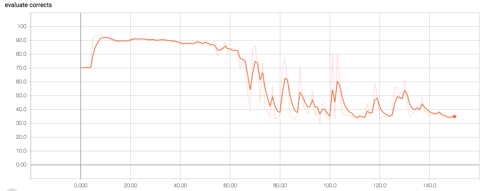
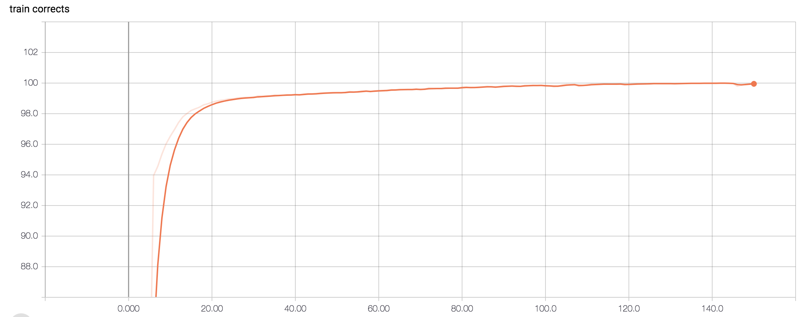

## Introduction
Module implemention from "[Deep Semantic Role Labeling: What Works and What’s Next](https://pdfs.semanticscholar.org/874e/f2e5488fcce82c48ed5b00fa1e5390a918e3.pdf)". <br>

<p align="center">

</p>

## Tutorial
Get [Tutorial]() if know Chinese

## Requirement
* python 3.6
* pytorch 0.4.1
* numpy 1.13.1

## Database
Perform experiments on the English data from [CoNLL 2003](https://www.clips.uantwerpen.be/conll2003/ner/)

Have downloaded in ${PROJECT}/data
```
data
├── testa
├── testb
└── train
```

## Train

Step.1 - Generate Corpus.pt
```
python3 corpus.py
```

Step.2 - Train data
```
python3 train.py
```

## Result
<p align="center">

</p>

<p align="center">

</p>
