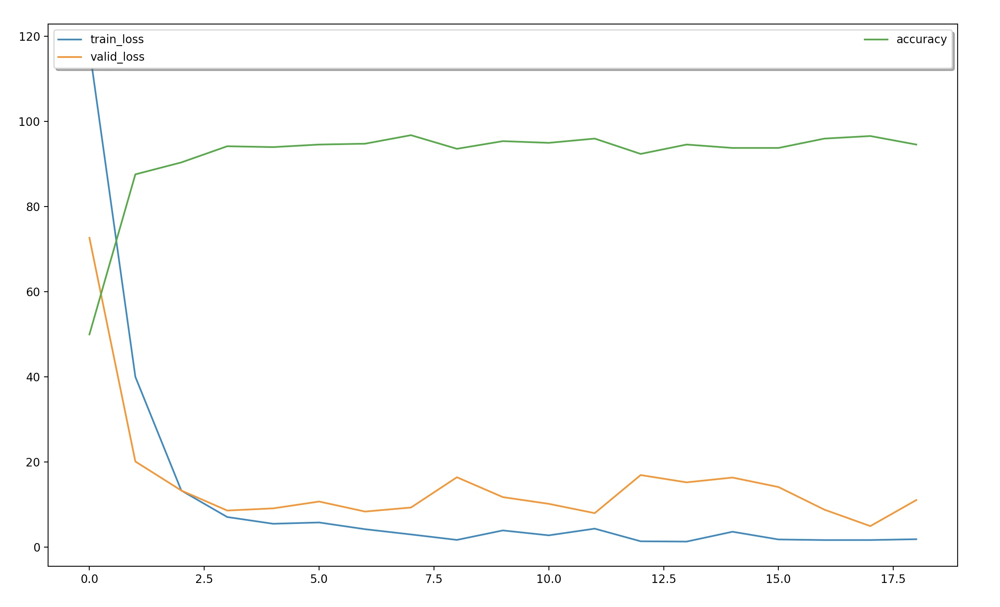

## Introduction
This is the implementation for LSTM Text Classfication. <br>
Perform experiments on the English data from [TREC](http://cogcomp.org/Data/QA/QC/)

## Requirement
* python 3.5
* pytorch 0.2.0
* numpy 1.13.1
* tqdm

## Usage
```
python3 main.py -h
```

You will get:

```
usage: main.py [-h] [--lr LR] [--epochs EPOCHS] [--batch-size BATCH_SIZE]
               [--seed SEED] [--cuda-able] [--save SAVE] [--data DATA]
               [--dropout DROPOUT] [--embed-dim EMBED_DIM]
               [--hidden-size HIDDEN_SIZE] [--lstm-layers LSTM_LAYERS]
               [--bidirectional]

LSTM text classification


optional arguments:
  -h, --help            show this help message and exit
  --lr LR               initial learning rate [default: 0.001]
  --epochs EPOCHS       number of epochs for train [default: 32]
  --batch-size BATCH_SIZE
                        batch size for training [default: 64]
  --seed SEED           random seed
  --cuda-able           enables cuda
  --save SAVE           path to save the final model
  --data DATA           location of the data corpus
  --dropout DROPOUT     the probability for dropout (0 = no dropout) [default:
                        0.5]
  --embed-dim EMBED_DIM
                        number of embedding dimension [default: 128]
  --hidden-size HIDDEN_SIZE
                        number of lstm hidden dimension [default: 128]
  --lstm-layers LSTM_LAYERS
                        biLSTM layer numbers
  --bidirectional       If True, becomes a bidirectional LSTM [default: False]
```

## Train
```
python3 main.py
```


## Result

> Acc: 88.6%
<p align="center"></p>
