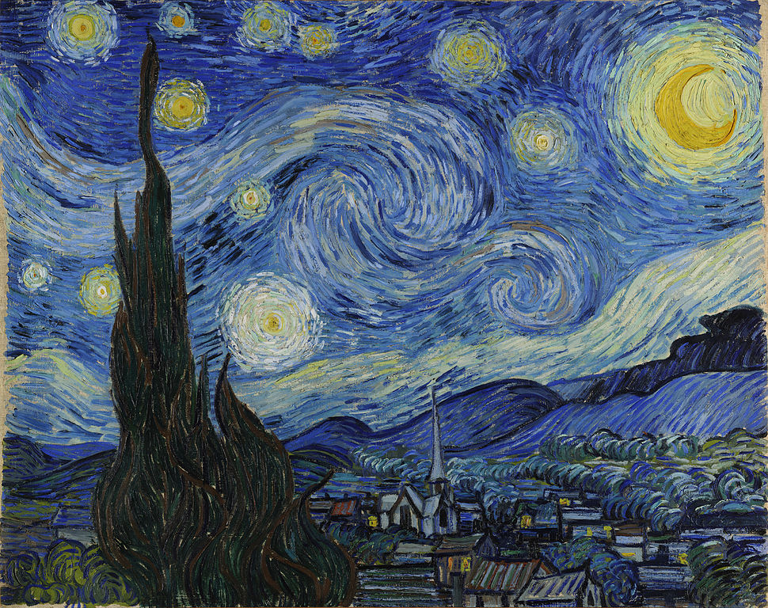
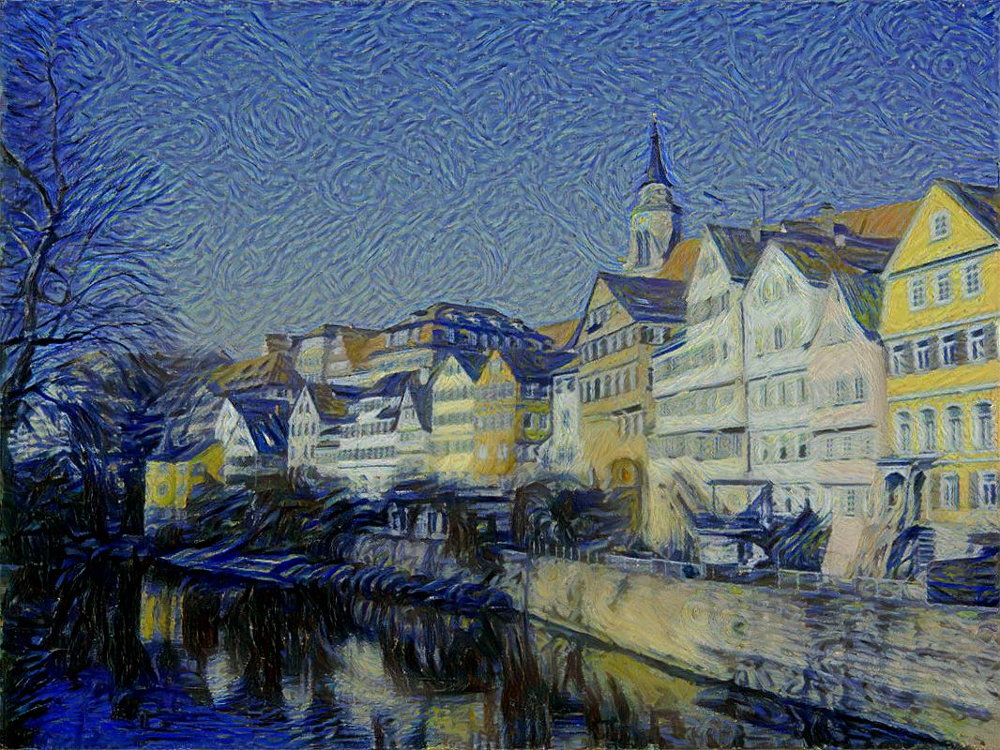
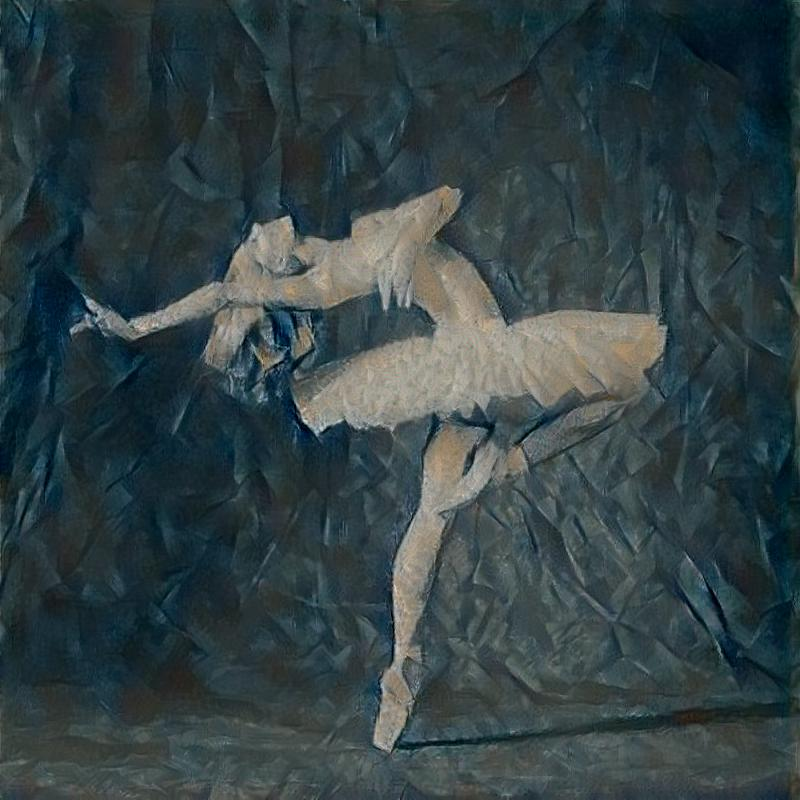

## Introduction
Neural Artistic Style.
Module implemention from "[A Neural Algorithm of Artistic Style](https://arxiv.org/abs/1508.06576)".  

## Tutorial
Get [Tutorial](https://zhuanlan.zhihu.com/p/32128704) if know Chinese

## Requirement
* python 3.5
* pytorch 0.2.0
* numpy 1.13.1
* PIL

## Example

### Van Gogh

### Picasso

