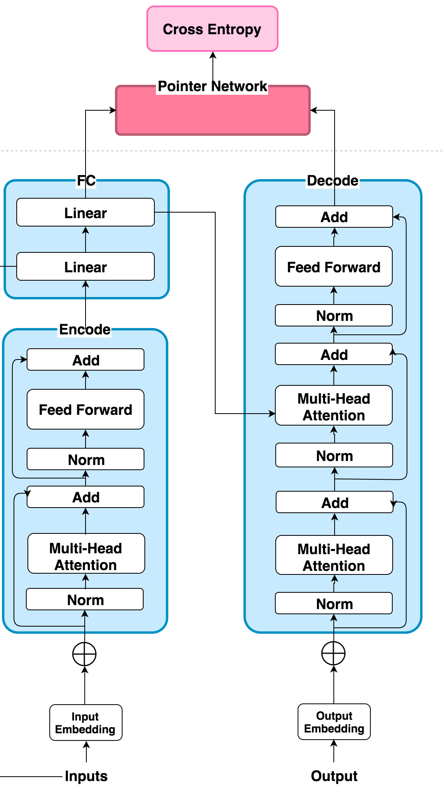
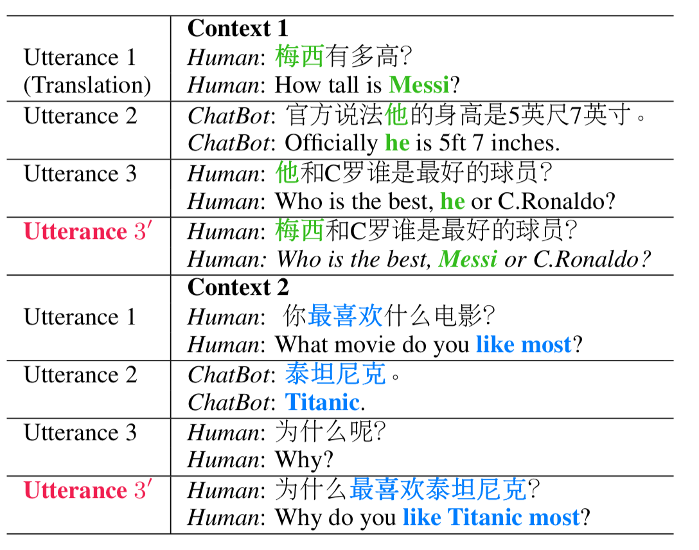
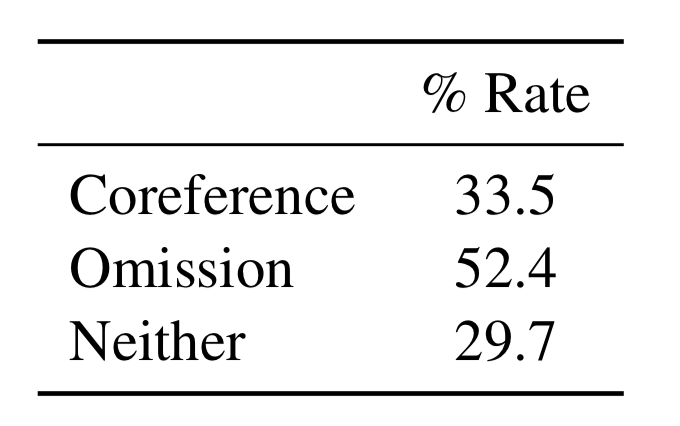

## Introduction

### Architecture of Model

#### An example of multi-turn dialogue. Each ut- terance 3 is rewritten into Utterance 3′. Green means coreference and blue means omission

#### Proportion of utterances containing corefer- ence and omission in multi-turn conversation

Randomly sample 2,000 conversational data and analyze how often coreference and omission occurs in multi-turn dialogues. lists the statistics. As can be seen, only less than 30% utterances have neither coreference nor omission and quite a few utterances have both. This further validates the importance of addressing the these situations in multi-turn dialogues.

