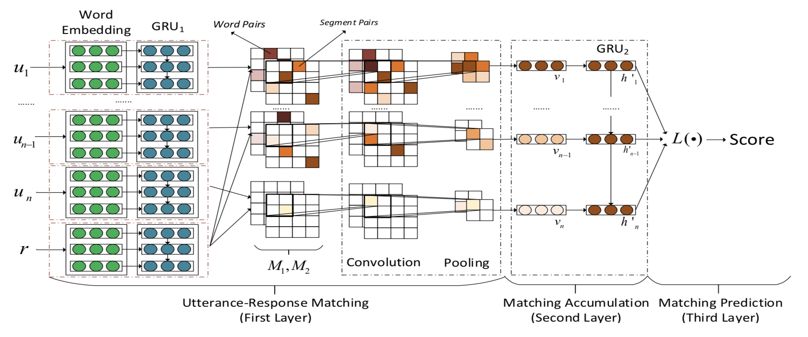
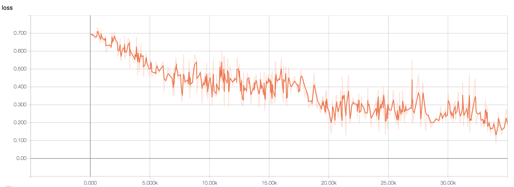
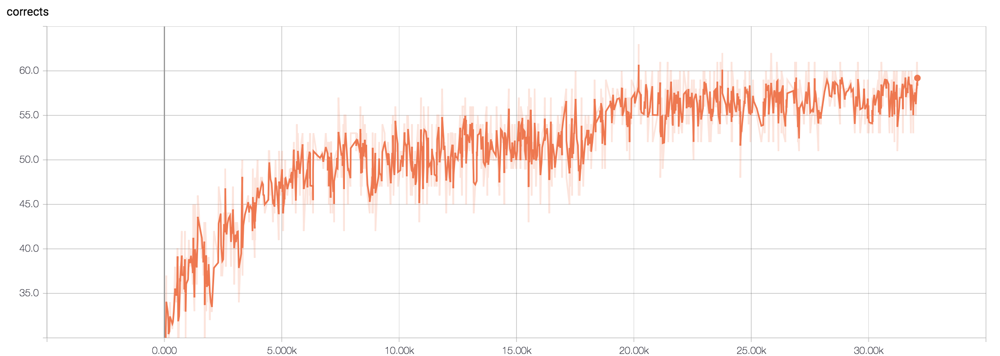

## A New Architecture for Multi-turn Response Selection in Retrieval-Based Chatbots
Module implemention from [paper](https://arxiv.org/pdf/1612.01627.pdf)

## Tutorial
Get [Tutorial](https://ne7ermore.github.io/post/retrieval-based-chatbots/) if know Chinese

## Model
<p align="center">

</p>

## Datasets - DoubanConversaionCorpus
* [Download](https://www.dropbox.com/s/90t0qtji9ow20ca/DoubanConversaionCorpus.zip?dl=0) datasets
* unzip DoubanConversaionCorpus.zip
* copy train.txt, dev.txt to $(PROJECT_HOME)/data

## Requirement
* python 3.6.2
* pytorch 0.4.0
* numpy 1.14.0

## How to train

### Prepare data
```
python3 corpus.py
```

### train and predict
```
python3 train.py
```


## Result

<p align="center">


</p>
