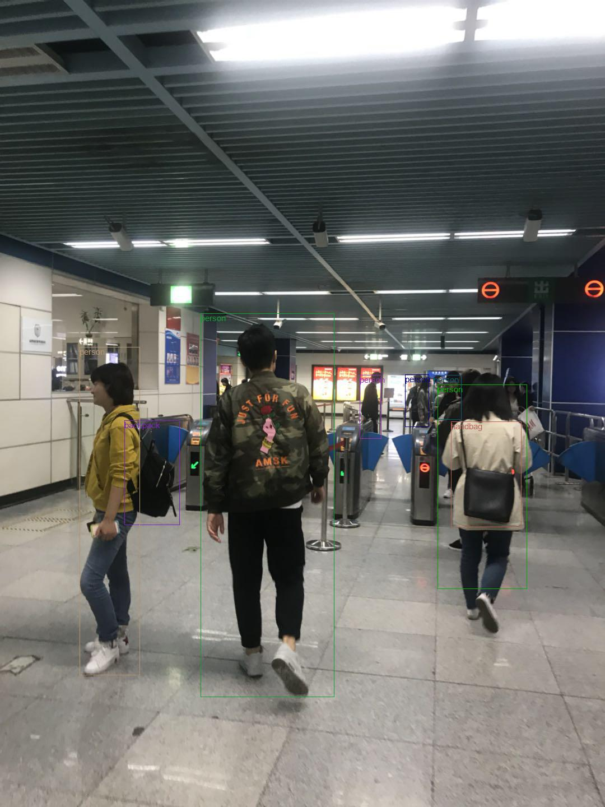

## Introduction
YOLO-v3 implemention from "[YOLOv3: An Incremental Improvement](https://pjreddie.com/media/files/papers/YOLOv3.pdf)". <br>
<p align="center"></p>

## Tutorial
Get tutorial series in [HomePage](https://ne7ermore.github.io/post/yolo-v3/)

## Requirement
```
pip install -r requirements.txt
```

## Usage

### Train
```
make

python3 train.py
```

### Detect
Download weight from [GoogleDrive](https://drive.google.com/file/d/1h3uo1lQoufEHPlGVHPF7_ZhqToTJkMvX/view?usp=sharing)
```
python3 detect.py
```

